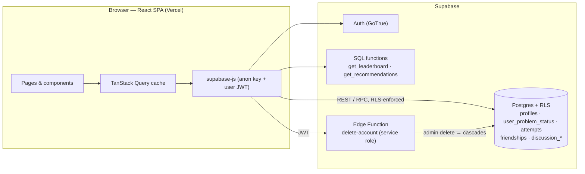

<!-- @format -->

# Aptigraph

[](https://github.com/b3njaminbaya/aptigraph/actions/workflows/ci.yml)
[](LICENSE)

A personal portfolio project by [Benjamin Baya](https://github.com/b3njaminbaya).

**Live demo: [aptigraph.vercel.app](https://aptigraph.vercel.app)**

## Overview

Aptigraph is a **LeetCode problem tracker** that helps you track your solving progress, spot weak topics, and build a consistent practice habit. It tracks solved/attempted problems, streaks, and topic-level analytics, gives rule-based recommendations for what to practice next based on your weakest topics, schedules solved problems for spaced review, and adds a social layer — a global leaderboard, friends, and per-problem discussion threads.

It is a full-stack app with a real backend: the interesting parts are not the screens but the **security model** (authorization lives in Postgres row-level security, and is tested against a real database), the **learning logic** (spaced repetition, streaks, recommendations), and the **test suite** that pins all of it down. See [Design decisions](#design-decisions).

## Features

### Problem Tracking

- A curated 74-problem catalog in the spirit of the well-known "Blind 75" list (title, difficulty, topics — no scraped problem statements), searchable and filterable by difficulty and topic
- Mark problems **solved** or **attempted**; log time-per-attempt (per problem) and free-text notes
- **Reset** a problem's status, notes, and review schedule (with a confirmation step) — your attempt history is kept for streaks and analytics
- Per-user data is stored in Supabase (Postgres) behind row-level security, not `localStorage` — it follows you across devices

### Analytics & Motivation

- Dashboard with solved count, current streak, and next-milestone tracking (with celebratory toasts on milestones)
- Difficulty breakdown and topic-strength heatmap (Recharts)
- **Spaced repetition**: solved problems come back for review on an SM-2-inspired schedule that adapts to whether you solve them again cleanly or struggle
- **Smart recommendations**: a SQL function surfaces problems from your weakest topics (lowest solve rate among topics you've actually attempted), and tells you _why_ ("Because you're at 25% on Two Pointers")

### Social

- Global **leaderboard** ranked by problems solved
- **Friends**: search by display name, send/accept/decline requests, compare solved counts
- **Discuss**: per-problem discussion threads with upvoting and comments

### Account

- Email/password authentication (Supabase Auth), including a "Forgot password?" email-reset flow
- Editable display name; avatars are generated deterministically per account ([DiceBear](https://www.dicebear.com/)) instead of accepting uploads
- Password change and full account deletion (via an Edge Function; cascades across all of a user's data)

### UI

- Dark/light theme (defaults to dark), built on [shadcn/ui](https://ui.shadcn.com/) and Tailwind CSS
- Responsive down to mobile, with route-based code splitting

## Tech Stack

- **Frontend**: [Vite](https://vitejs.dev/) + [React 18](https://react.dev/) + TypeScript (strict), [Tailwind CSS](https://tailwindcss.com/) + shadcn/ui, [TanStack Query](https://tanstack.com/query) for server state, [React Router](https://reactrouter.com/), [Recharts](https://recharts.org/)
- **Backend**: [Supabase](https://supabase.com/) — Postgres with row-level security, Auth, auto-generated REST/RPC (PostgREST), and one Edge Function (account deletion)
- **Testing**: [Vitest](https://vitest.dev/) + [Testing Library](https://testing-library.com/) for the frontend; plain SQL assertions on a throwaway Postgres container for the database
- **CI**: GitHub Actions — lint, typecheck, tests with coverage thresholds, build, and the database suite
- **Hosting**: [Vercel](https://vercel.com/) (static SPA + security headers)

## Architecture



The browser talks to Supabase directly. There is no application server to secure: **the database is the authorization layer**, so every table has row-level security and the browser only ever holds the public anon key plus the signed-in user's JWT.

## Design decisions

Each entry: what I chose, why, and what it costs.

### Authorization lives in Postgres, not in application code

Every table has RLS policies keyed on `auth.uid()`. Progress and attempts are private to their owner, the problem catalog is public read-only, discussion is public read / owner write, friendships are visible only to the two parties. The anon key in the bundle is therefore safe to publish — it grants nothing RLS doesn't allow. **Trade-off:** correctness now depends on SQL that is easy to get subtly wrong, so it is tested directly (see [Testing](#testing)). That suite found five real bugs in the original policies and functions, including upvotes on other people's posts never being counted and a way to forge friendships.

### The leaderboard is a `SECURITY DEFINER` function that returns aggregates only

Ranking users needs to read everyone's progress, which RLS (rightly) forbids. Rather than loosening the table's policies, `get_leaderboard` runs with elevated rights, pins `search_path`, and returns exactly five columns — id, display name, avatar, solved count, last active. A test asserts the function's return type so a future edit can't accidentally leak notes or attempt history. It is callable by anonymous visitors on purpose (a public leaderboard). **Trade-off:** there is no opt-out yet; see [limitations](#known-limitations-and-what-id-do-next).

### Recommendations are a rule-based SQL function, not a model

`get_recommendations` finds the caller's three weakest topics (lowest solve rate among topics they've attempted), then offers the two easiest unsolved problems in each, one row per problem, weakest topic first. It runs as `SECURITY INVOKER`, so it sees only the caller's rows through RLS — no privileged code path to audit. Because it is a rule, the UI can say _why_ a problem was suggested, which a black-box ranker couldn't. **Trade-off:** it can't learn from behaviour beyond solve rate. A brand-new user has no history, so the client falls back to starter Easy problems.

### Spaced repetition is SM-2-inspired, not SM-2

The app only knows solved / not solved on a review, not a 0–5 recall grade, so classic SM-2 doesn't apply. Success grows the interval (`interval × ease`, ease +0.1, capped at 3.0); failure resets the interval to one day and lowers ease (−0.2, floored at 1.3). The scheduler is a pure function (`lib/spacedRepetition.ts`), and the schedule is stored on each progress row. A failed review **keeps the problem solved** and due tomorrow — an early version demoted it to "attempted", which silently removed it from the review queue and from the user's score; a test now pins this. **Trade-off:** the client computes the schedule, so a user can tamper with their own — which only affects themselves.

### Streaks come from an append-only attempt log, in local time

Attempts are inserted and never updated or deleted (there is no UPDATE/DELETE policy, and a test asserts it), so history is trustworthy. The streak is derived from it using the user's **local** calendar days — mixing UTC and local dates caused an off-by-one in the first version, so the code and its tests use local dates throughout, and a streak survives until the end of "tomorrow" rather than zeroing at midnight. "Reset problem" clears the current status but deliberately keeps the log.

### One `QueryClient`, one error path

All server state goes through TanStack Query, and a single client (`lib/queryClient.ts`) turns any failed query or mutation into an error toast. Call sites therefore only describe **success**: toasts fire from `onSuccess`, and form drafts are cleared only once the write is confirmed. This removed a class of bugs where the UI announced "Posted" for a write that then failed, or wiped a long comment on error. Queries that depend on who is viewing are keyed by user id, so one person's vote state can never be shown to the next person who signs in on the same tab.

### Auth never throws into the UI

Supabase's client rejects on network failure instead of returning `{ error }`. The auth wrappers catch that and always return a message, and every direct Supabase call in a page uses `try/finally`, so a dropped connection re-enables the button instead of leaving it stuck on "Signing in…". A `loading` flag distinguishes "not signed in" from "session not loaded yet", so a signed-in user refreshing `/settings` isn't bounced to the login page.

### Account deletion is the only place the service-role key exists

Deleting an auth user needs the service-role key, which must never reach the browser. An Edge Function first verifies the caller's JWT with the anon key, then deletes exactly that user; foreign keys with `ON DELETE CASCADE` remove everything else, and a trigger keeps other people's upvote counts consistent. The database suite verifies the cascade end to end.

### Deliberately small surface area

Avatars are generated (DiceBear) instead of uploaded, which means no storage bucket, no image moderation and no unbounded-URL rendering. Routes are code-split with the landing page eager. The app ships a strict Content-Security-Policy and other hardening headers via [`vercel.json`](vercel.json), limited to the origins it actually uses.

## Testing

```sh
npm test               # frontend unit + component tests (Vitest)
npm run test:coverage  # same, with coverage thresholds (what CI runs)
npm run test:db        # database tests against the real migrations (needs Docker)
```

**Frontend (~250 tests, ~99% statement / ~92% branch coverage, thresholds enforced in CI).** Pure logic (streaks, spaced repetition, milestones) is unit-tested. Everything else is tested through the UI the way a user drives it, with the **Supabase client mocked at the module boundary** by a small chainable fake (`src/test/supabaseMock.ts`) that records every call — so tests assert on the exact payloads and filters sent (the `upsert` body, the `.eq('user_id', …)` scoping), while real React Query, real routing and the real `AuthProvider` run underneath. Tests named `regression:` each reproduce a bug that was found and fixed. I checked that the tests aren't decorative by re-introducing ten of those bugs one at a time and confirming each turned the suite red.

**Database (100 assertions).** `scripts/test-db.sh` starts a throwaway Postgres container, applies the project's **actual migration files** on top of minimal Supabase stand-ins (`auth.uid()`, the `anon`/`authenticated` roles, Supabase's default grants), and asserts behaviour while acting as different users: can't read or write another user's rows, RLS-blocked UPDATE/DELETE affect zero rows, CHECK constraints hold, triggers and cascades behave, and the two SQL functions return the right thing to the right caller. It runs in CI with no secrets.

**Not covered:** the Edge Function (needs the Supabase runtime), the PostgREST/Auth HTTP layer itself (the DB tests emulate its roles rather than run the full stack), and there are no browser end-to-end tests — the deployed app was smoke-tested by hand.

## Getting Started

### 1. Clone and install

```sh
git clone https://github.com/b3njaminbaya/aptigraph.git
cd aptigraph
npm install
```

### 2. Create a Supabase project

A [free Supabase project](https://supabase.com/) is enough.

1. Create a project in the Supabase dashboard.
2. `cp .env.example .env`, then fill in the project URL and **anon** key (Project Settings → API). Never use the service-role key here.
3. Apply the migrations with the [Supabase CLI](https://supabase.com/docs/guides/cli):
   ```sh
   supabase link --project-ref <your-project-ref>
   supabase db push
   ```
4. (Optional) Deploy the account-deletion function: `supabase functions deploy delete-account`
5. In **Authentication → URL Configuration**, set the Site URL to where the app runs and add `<that URL>/reset-password` to Redirect URLs — required for "Forgot password?" (for local dev: `http://localhost:8080/reset-password`).

### 3. Run it

```sh
npm run dev      # http://localhost:8080
```

## Deployment

The app is a static Vite build, deployed on Vercel.

1. Import the repository in Vercel (the framework preset is detected; [`vercel.json`](vercel.json) adds SPA routing, immutable caching for hashed assets, and the security headers).
2. Set `VITE_SUPABASE_URL` and `VITE_SUPABASE_ANON_KEY` in the project's environment variables.
3. In Supabase, add the deployed URL and its `/reset-password` path to the Auth redirect URLs (step 5 above).

## Project structure

```
src/
  pages/          route components (one per screen)
  components/     shared UI; ui/ is vendored shadcn/ui
  state/          auth and tracker context providers
  data/, hooks/   React Query hooks over Supabase tables and RPCs
  lib/            pure logic: streak, spaced repetition, milestones, query client
  test/           Supabase mock and provider-aware render helpers
supabase/
  migrations/     schema, RLS policies, SQL functions (applied in order)
  functions/      delete-account Edge Function
  tests/          database test suite (SQL)
scripts/          test-db.sh
```

## Known limitations, and what I'd do next

- **The leaderboard is self-reported.** Nothing verifies a LeetCode solve, so it can be gamed. Verifying would need LeetCode integration, which they don't offer officially — this is a tracker, not a competition platform.
- **The leaderboard and profiles are visible to anonymous visitors, with no opt-out.** A privacy toggle (hide me from the leaderboard) is the obvious next feature.
- **A declined friend request can't be re-sent** (the row is kept, so a second request hits the unique key). Needs a product decision: allow re-requests after a cooldown, or delete on decline.
- **Discussion has no edit/report/moderation UI** and relies on Supabase's default rate limits.
- **The main JavaScript bundle is ~640 kB** (Recharts and Radix dominate). Manual chunking, or a lighter chart library, is the next performance win.
- **No browser end-to-end tests.** A Playwright suite against a local Supabase would close the gap between the mocked frontend tests and the SQL tests.
- The problem catalog is a static seed; there is no admin tooling for it.

## Security

Found a security issue? See [SECURITY.md](SECURITY.md) for how to report it privately.

## License

MIT © Benjamin Baya. See [LICENSE](LICENSE).

## Contact

Feedback and questions are welcome — reach me at [b3njaminbaya@gmail.com](mailto:b3njaminbaya@gmail.com).
